# Diagrama e Documentação de Arquitetura do Projeto
## Sistema de Simulação e Monitoramento CCO de Ônibus (SPTrans & TimescaleDB)

---

### 🏛️ Diagrama de Arquitetura em PlantUML (Layout Organizado)

```plantuml
@startuml
!theme superhero
skinparam backgroundColor #090d16
skinparam defaultFontName "Inter", "Segoe UI", sans-serif
skinparam defaultFontSize 12
skinparam defaultFontColor #ffffff
skinparam roundcorner 12
skinparam shadowing true

skinparam package {
    BorderColor #475569
    BackgroundColor #0f172a
    FontColor #ffffff
    FontStyle bold
    FontSize 14
}

skinparam rectangle {
    BorderColor #64748b
    BackgroundColor #1e293b
    FontColor #ffffff
}

skinparam database {
    BorderColor #38bdf8
    BackgroundColor #1e1b4b
    FontColor #ffffff
}

skinparam artifact {
    BorderColor #4ade80
    BackgroundColor #14532d
    FontColor #ffffff
}

skinparam component {
    FontColor #ffffff
}

skinparam storage {
    FontColor #ffffff
}

skinparam arrow {
    Thickness 2
    Color #38bdf8
    FontColor #ffffff
    FontSize 11
}

title "<b>ARQUITETURA DE DADOS EM TEMPO REAL - SIMULAÇÃO CCO SPTRANS</b>\n<font size=12 color=#ffffff>Pipeline de Streaming com Kafka + Flink + TimescaleDB + Grafana Loki</font>"

left to right direction

rectangle "<b><font color=#ffffff>🌐 1. FONTE DE DADOS EXTERNA</font></b>" #0284c7 {
    component "<b><font color=#ffffff>SPTrans Olho Vivo API v2.1</font></b>\n<font size=10 color=#ffffff>HTTPS REST / JSON /Posicao</font>" as sptrans_api #0369a1
}

rectangle "<b><font color=#ffffff>🐍 2. INGESTÃO & SERIALIZAÇÃO</font></b>" #1e1b4b {
    component "<b><font color=#ffffff>python-producer</font></b>\n<font size=10 color=#ffffff>Script Python Poller & Ingestor</font>" as python_prod #2563eb
    component "<b><font color=#ffffff>Confluent Schema Registry 7.8.0</font></b>\n<font size=10 color=#ffffff>Validação AVRO (posicao_onibus.avsc)</font>" as schema_reg #7c3aed
}

rectangle "<b><font color=#ffffff>📦 3. CAMADA DE MENSAGERIA (KAFKA)</font></b>" #450a0a {
    database "<b><font color=#ffffff>Apache Kafka Broker 4.1.1</font></b>\n<font size=10 color=#ffffff>Modo KRaft (Porta 9092)</font>" as kafka_broker #991b1b {
        storage "<b><font color=#ffffff>posicoes_sptrans</font></b>\n<font size=10 color=#ffffff>Stream Principal de Eventos AVRO</font>" as topic_posicoes #b91c1c
        storage "<b><font color=#ffffff>posicoes_sptrans_dlq</font></b>\n<font size=10 color=#ffffff>Dead-Letter Queue (Exceções)</font>" as topic_dlq #991b1b
    }
    component "<b><font color=#ffffff>Provectus Kafka UI</font></b>\n<font size=10 color=#ffffff>Web UI (Porta 8084)</font>" as kafka_ui #7f1d1d
}

rectangle "<b><font color=#ffffff>⚡ 4. PROCESSAMENTO EM FLUXO (FLINK 1.20)</font></b>" #7c2d12 {
    component "<b><font color=#ffffff>flink-jobmanager</font></b>\n<font size=10 color=#ffffff>Master Orquestrador (Porta 8081)</font>" as flink_jm #ea580c
    component "<b><font color=#ffffff>flink-taskmanager</font></b>\n<font size=10 color=#ffffff>Workers Paralelos (10 Task Slots)</font>" as flink_tm #d97706
    component "<b><font color=#ffffff>flink-sql-client</font></b>\n<font size=10 color=#ffffff>Flink SQL Pipelines & Janelas</font>" as flink_sql #c2410c
}

rectangle "<b><font color=#ffffff>🐘 5. ARMAZENAMENTO TEMPORAL (TIMESCALEDB)</font></b>" #064e3b {
    database "<b><font color=#ffffff>TimescaleDB Engine</font></b>\n<font size=10 color=#ffffff>PostgreSQL 17 (Porta 5432) | Database: sptrans</font>" as timescale_db #15803d {
        folder "<b><font color=#ffffff>Tabelas de Estado Operacional</font></b>" #166534 {
            artifact "<font color=#ffffff>tb_posicao_atual_onibus</font>" as tbl_posicao #22c55e
            artifact "<font color=#ffffff>tb_veiculos_em_operacao</font>" as tbl_veiculos #22c55e
            artifact "<font color=#ffffff>shapes & trips (GTFS)</font>" as tbl_gtfs #22c55e
        }
        folder "<b><font color=#ffffff>Hypertables (Séries Temporais - ZSTD)</font></b>" #14532d {
            artifact "<font color=#ffffff>tb_historico_velocidade_por_linha</font>" as hyper_vel #16a34a
            artifact "<font color=#ffffff>tb_historico_headway_por_linha</font>" as hyper_headway #16a34a
        }
    }
}

rectangle "<b><font color=#ffffff>📊 6. VISUALIZAÇÃO & OBSERVABILIDADE (GRAFANA STACK)</font></b>" #065f46 {
    component "<b><font color=#ffffff>Grafana Dashboards (v11)</font></b>\n<font size=10 color=#ffffff>Painéis CCO + Fuso: America/Sao_Paulo (UTC-3)</font>" as grafana #059669
    component "<b><font color=#ffffff>Grafana Loki</font></b>\n<font size=10 color=#ffffff>Engine de Logs (Porta 3100)</font>" as loki #047857
    component "<b><font color=#ffffff>Grafana Alloy</font></b>\n<font size=10 color=#ffffff>Coletor Daemon de Logs (Porta 12345)</font>" as alloy #065f46
}

' ==============================================================================
' FLUXO DE DADOS SEQUENCIAL ALINHADO
' ==============================================================================

sptrans_api -[#38bdf8,bold]-> python_prod : <color:#ffffff>1. GET /Posicao</color>
python_prod <-[#c084fc,bold]-> schema_reg : <color:#ffffff>2. AVRO Schema</color>
python_prod -[#f87171,bold]-> topic_posicoes : <color:#ffffff>3. Eventos AVRO</color>
python_prod .[#fca5a5,dashed].> topic_dlq : <color:#ffffff>Desvio DLQ</color>

topic_posicoes -[#fb923c,bold]-> flink_sql : <color:#ffffff>4. Event-Time Stream</color>
flink_jm .[#fdba74,dashed].> flink_tm : <color:#ffffff>Checkpoints</color>
flink_sql -[#fb923c,bold]-> flink_tm : <color:#ffffff>Janelas 1 min</color>

flink_tm -[#4ade80,bold]-> timescale_db : <color:#ffffff>5. Sink Hypertables</color>

timescale_db -[#34d399,bold]-> grafana : <color:#ffffff>6. Consultas SQL CCO</color>

alloy -[#6ee7b7,bold]-> loki : <color:#ffffff>Logs Container</color>
loki -[#6ee7b7,bold]-> grafana : <color:#ffffff>7. LogQL</color>

kafka_ui .[#fca5a5,dashed].> kafka_broker : <color:#ffffff>UI Monitor</color>

@enduml
```

---

### 🔍 Explicação dos Componentes da Arquitetura

1. **Ingestão (`python-producer` & SPTrans Olho Vivo)**:
   - Conecta-se à API REST Olho Vivo da SPTrans via HTTPS.
   - Realiza polling contínuo da posição dos ônibus e registra/valida o esquema AVRO no **Confluent Schema Registry** (`schema-registry`).

2. **Mensageria (`kafka` & `kafka-ui`)**:
   - Cluster Apache Kafka 4.1.1 em modo **KRaft** (sem ZooKeeper).
   - Ingestão contínua no tópico `posicoes_sptrans` (mensagens serializadas em AVRO).
   - Redirecionamento de exceções para a Dead-Letter Queue `posicoes_sptrans_dlq`.

3. **Processamento em Fluxo (`flink-jobmanager`, `flink-taskmanager`, `flink-sql-client`)**:
   - Engine Apache Flink v1.20.0 em cluster distribuído.
   - Executa agregações em janelas temporais de 1 minuto (*Tumbling Windows*) via **Flink SQL**.
   - Calcula métricas de velocidade e headway com *watermarking* e estado garantido por *checkpoints*.

4. **Armazenamento Temporal & Relacional (`timescaledb`)**:
   - Banco de dados PostgreSQL 17 com extensão **TimescaleDB** no banco `sptrans`.
   - Armazena tabelas de estado operacional (`tb_posicao_atual_onibus`, `tb_veiculos_em_operacao`, `tb_linhas_onibus_filtro`) e tabelas geométricas GTFS (`shapes`, `trips`).
   - Armazena séries temporais históricas em **Hypertables** comprimidas em ZSTD (`tb_historico_velocidade_por_linha`, `tb_historico_headway_por_linha`).

5. **Apresentação & Observabilidade (`grafana`, `loki`, `alloy`)**:
   - **Grafana** (Porta 3000): Renderiza os dashboards em fuso horário de Brasília (`America/Sao_Paulo` / UTC-3).
   - **Datasource TimescaleDB**: Executa queries SQL diretas para atualizar os KPIs CCO, diagnósticos de comboiamento e a rota Geomap.
   - **Datasource Loki**: Coleta logs de todos os containers via **Grafana Alloy** para visualização de métricas de infraestrutura via LogQL.
